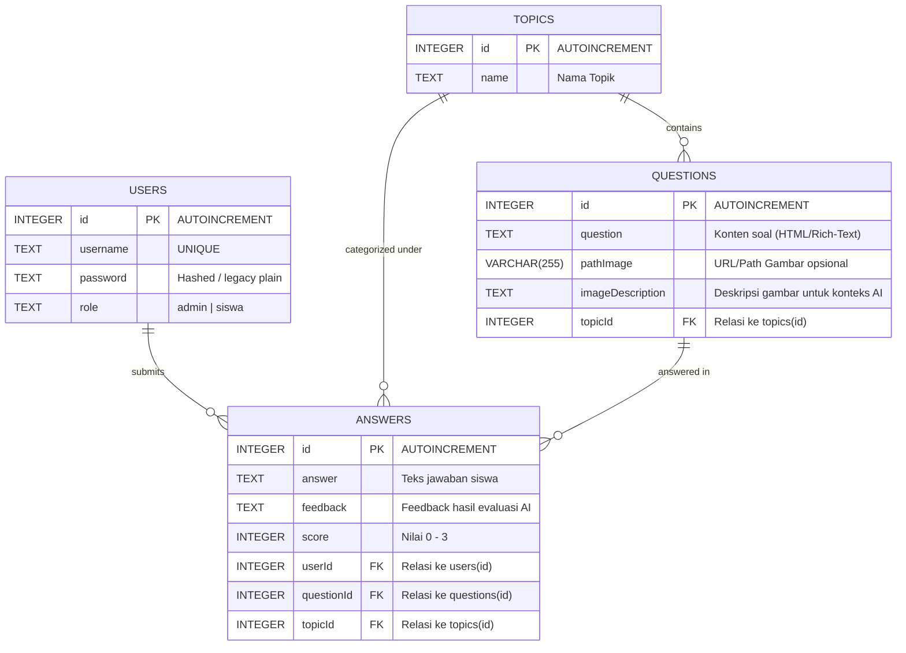
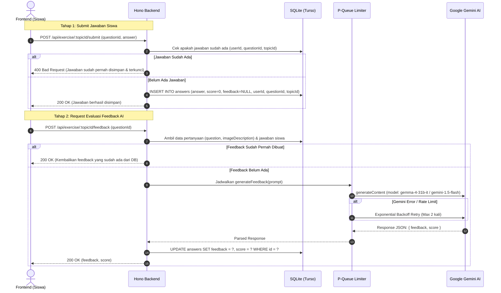

# Product Requirement Document (PRD) - Backend Service
## MentorAI: AI-Powered Interactive Assessment Platform (Refactored)

---

## 1. Executive Summary & Project Overview

### 1.1 Latar Belakang
MentorAI adalah platform latihan soal interaktif yang membimbing siswa melalui evaluasi otomatis berbasis kecerdasan buatan (Google Gemini/Gemma). Pada sistem legacy, aplikasi dibangun menggunakan arsitektur monolitik Express 5, EJS templating engine, dan driver `sqlite3` callback-based. 

Untuk meningkatkan performa, type safety, modularitas, skalabilitas edge-ready, dan kemudahan pemeliharaan, arsitektur sistem dirombak menjadi **Decoupled Architecture** (Backend RESTful API & Frontend SPA terpisah).

### 1.2 Tujuan Refaktor Backend
1. **Pemisahan Tanggung Jawab (Separation of Concerns)**: Backend murni berperan sebagai stateless RESTful API engine penyedia data dan orkestrasi AI.
2. **Type Safety End-to-End**: Seluruh codebase backend menggunakan TypeScript dengan validasi skema runtime via Zod.
3. **High Performance & Modern Web Standards**: Menggunakan **Hono framework** yang sangat ringan, cepat, dan kompatibel dengan standar Web API (Request/Response).
4. **Database Modernization**: Menggantikan driver legacy `sqlite3` dengan **Turso SQLite (`@libsql/client`)** dan **Drizzle ORM**, tanpa mengubah struktur skema database relasional yang telah ada.
5. **Robust AI Evaluation Pipeline**: Menjaga efisiensi pemanggilan Google Gemini API dengan antrean konkurensi (`p-queue`) dan mekanisme exponential backoff retry.

---

## 2. Technology Stack & Dependencies

| Kategori | Teknologi / Library | Alasan Pemilihan |
| :--- | :--- | :--- |
| **Runtime Engine** | Node.js (v20+ LTS) / Bun | Kompatibilitas luas, performa tinggi, native fetch & Web Streams. |
| **Language** | TypeScript (v5+) | Strict type checking, auto-completion, meminimalisir runtime error. |
| **Web Framework** | **Hono** (`hono`) | Sangat cepat, footprint memori minimal, middleware modular, native TypeScript & Web Standards. |
| **Database Engine** | **SQLite Turso** (`@libsql/client`) | SQLite modern berkemampuan distributed edge, mendukung koneksi file lokal (`file:./db.sqlite`) maupun Turso Cloud (libSQL over HTTP/WebSocket). |
| **ORM & Migrations** | **Drizzle ORM** (`drizzle-orm`, `drizzle-kit`) | Zero-overhead, type-safe SQL-like queries, performa jauh lebih cepat dibanding Prisma, migrasi deklaratif. |
| **Request Validation** | **Zod** (`zod`, `@hono/zod-validator`) | Validasi schema request (body, query, params) terintegrasi langsung dengan context types Hono. |
| **Authentication** | **JWT** (`hono/jwt`) + **Argon2** / **Bcrypt** (`bcryptjs`) | Stateless auth berbasis token via HTTP-only Cookies atau Authorization Header, dilengkapi hashing password yang aman. |
| **AI Evaluation Engine**| **Google GenAI SDK** (`@google/genai`) | Mengintegrasikan model Gemini / Gemma (`gemini-1.5-flash` / `gemma-4-31b-it`) untuk evaluasi jawaban siswa secara terstruktur (JSON output). |
| **Concurrency & Queue**| **p-queue** (`p-queue`) | Manajemen antrean request AI agar tidak terkena rate-limit quota (concurrency limiter). |
| **Excel Export** | **ExcelJS** (`exceljs`) | Pembentukan dokumen `.xlsx` laporan rekapitulasi nilai siswa secara dinamis dan kaya format. |
| **File Storage** | Local Storage / Static Serve (`@hono/node-server/serve-static`) | Manajemen upload file gambar pendukung soal. |
| **Security & Utilities**| `cors`, `dotenv`, `hono/logger`, `hono/pretty-json` | Middleware CORS, pemantauan log request, environment configuration. |

---

## 3. Database Architecture & Schema Consistency

Struktur tabel dipertahankan **100% konsisten** dengan database SQLite legacy (`old/app.js`), memastikan data lama dapat diimigrasikan atau dibaca secara langsung tanpa konflik relasi.

### 3.1 Entity Relationship Diagram (ERD)



### 3.2 Drizzle ORM Schema Definition (`src/db/schema.ts`)

```typescript
import { sqliteTable, integer, text } from "drizzle-orm/sqlite-core";
import { relations } from "drizzle-orm";

// 1. Table Users
export const users = sqliteTable("users", {
  id: integer("id").primaryKey({ autoIncrement: true }),
  username: text("username").unique().notNull(),
  password: text("password").notNull(),
  role: text("role").notNull(), // 'admin' | 'siswa'
});

// 2. Table Topics
export const topics = sqliteTable("topics", {
  id: integer("id").primaryKey({ autoIncrement: true }),
  name: text("name").notNull(),
});

// 3. Table Questions
export const questions = sqliteTable("questions", {
  id: integer("id").primaryKey({ autoIncrement: true }),
  question: text("question").notNull(),
  pathImage: text("pathImage"), // VARCHAR(255) in SQLite maps to text
  imageDescription: text("imageDescription"),
  topicId: integer("topicId").references(() => topics.id, { onDelete: "cascade" }),
});

// 4. Table Answers
export const answers = sqliteTable("answers", {
  id: integer("id").primaryKey({ autoIncrement: true }),
  answer: text("answer"),
  feedback: text("feedback"),
  score: integer("score").default(0),
  userId: integer("userId").references(() => users.id, { onDelete: "cascade" }),
  questionId: integer("questionId").references(() => questions.id, { onDelete: "cascade" }),
  topicId: integer("topicId").references(() => topics.id, { onDelete: "cascade" }),
});

// Relations Definitions for Drizzle Relational Queries
export const usersRelations = relations(users, ({ many }) => ({
  answers: many(answers),
}));

export const topicsRelations = relations(topics, ({ many }) => ({
  questions: many(questions),
  answers: many(answers),
}));

export const questionsRelations = relations(questions, ({ one, many }) => ({
  topic: one(topics, {
    fields: [questions.topicId],
    references: [topics.id],
  }),
  answers: many(answers),
}));

export const answersRelations = relations(answers, ({ one }) => ({
  user: one(users, {
    fields: [answers.userId],
    references: [users.id],
  }),
  question: one(questions, {
    fields: [answers.questionId],
    references: [questions.id],
  }),
  topic: one(topics, {
    fields: [answers.topicId],
    references: [topics.id],
  }),
}));
```

### 3.3 Database Client Provider (`src/db/index.ts`)

```typescript
import { createClient } from "@libsql/client";
import { drizzle } from "drizzle-orm/libsql";
import * as schema from "./schema";

const client = createClient({
  url: process.env.DATABASE_URL || "file:./db.sqlite",
  authToken: process.env.DATABASE_AUTH_TOKEN, // Opsional jika menggunakan Turso Cloud
});

export const db = drizzle(client, { schema });
```

### 3.4 Data Migration & Compatibility Notes
- **Password Strategy**: Sistem legacy menyimpan password dalam format plain text (`"123"`). Pada sistem baru, service autentikasi akan mendukung pengecekan password legacy (jika string tidak diawali hash bcrypt `$2a$` / argon2 `$argon2id$`) dan otomatis melakukan **transparent upgrade** ke hash bcrypt/argon2 saat user login pertama kali.
- **Default Seed**: Memastikan admin default (`admin` / `123` / role `admin`) terdaftar secara otomatis saat inisialisasi database.

---

## 4. Backend System Architecture & Modules

```
backend/
├── src/
│   ├── config/             # Environment variables & constants
│   ├── db/                 # Drizzle schemas, migrations & client connection
│   │   ├── migrations/
│   │   ├── index.ts
│   │   ├── schema.ts
│   │   └── seed.ts
│   ├── middlewares/        # Auth JWT, Role Guard, Error Handler, Logger
│   │   ├── auth.middleware.ts
│   │   ├── role.middleware.ts
│   │   └── error.middleware.ts
│   ├── modules/            # Domain-driven feature modules
│   │   ├── auth/           # Login, Register, Me, Logout
│   │   ├── topics/         # Topic management (CRUD)
│   │   ├── questions/      # Question CRUD + image upload
│   │   ├── exercise/       # Exercise session, submit answer, AI feedback
│   │   ├── my-answers/     # Student answers history & scores
│   │   ├── students-answers/# Teacher view of student results
│   │   ├── export/         # Excel report generator
│   │   └── admin-db/       # Raw DB table management (users & answers)
│   ├── services/           # External services (Gemini AI, Excel generator, Storage)
│   │   ├── gemini.service.ts
│   │   ├── excel.service.ts
│   │   └── storage.service.ts
│   ├── utils/              # Helper functions, standard response formatters
│   └── index.ts            # Hono application bootstrap & route mounting
├── public/
│   └── uploads/            # Uploaded question images
├── drizzle.config.ts       # Drizzle Kit configuration
├── package.json
└── tsconfig.json
```

---

## 5. Core Business Workflows

### 5.1 Alur Pengerjaan Latihan & Evaluasi AI (Dua Tahap)

Untuk memastikan kehandalan dan mencegah data loss jika AI mengalami rate limit atau timeout, sistem mempertahankan mekanisme penyimpanan terpisah antara **Jawaban Siswa** dan **Evaluasi AI**:



### 5.2 AI Prompt & Rubrik Penilaian
Prompt yang dikirimkan ke model Gemini/Gemma wajib mempertahankan format instruktif:
```text
Tugas Anda: nilai jawaban siswa secara objektif.
Output wajib berupa JSON valid tanpa teks tambahan dengan format {"feedback":"...", "score":<0-3>}.
Ketentuan:
- Feedback edukatif maksimal 3 kalimat (lebih pendek lebih baik) dan jangan membocorkan jawaban, arahkan siswa berpikir logis.
- Skor berupa angka 0 hingga 3 sesuai ketepatan jawaban.
Pertanyaan: "${questionData.question}"
Gambar pendukung soal: "${questionData.imageDescription || "-"}"
Jawaban siswa: "${existingAnswer.answer}"
```
*Aturan Skor*:
- `0`: Jawaban salah total atau tidak relevan.
- `1`: Jawaban kurang tepat namun memiliki sedikit keterkaitan konsep.
- `2`: Jawaban hampir benar, ada sedikit kekurangan penjelasan.
- `3`: Jawaban tepat, lengkap, dan logis.

### 5.3 Export Laporan Nilai Excel
Mekanisme export file Excel (`ExcelJS`) menyusun lembar kerja dengan ketentuan:
1. Header baris 1 (Bold): `No`, `Nama Siswa`, lalu dinamis untuk setiap soal: `Jawaban 1`, `Feedback 1`, `Jawaban 2`, `Feedback 2`, ..., dan diakhiri `Total Skor`.
2. Total skor dihitung dengan formula persentase standar:
   $$\text{Nilai Akhir (\%)} = \text{round}\left( \frac{\sum \text{score}}{N_{\text{soal}} \times 3} \times 100 \right)$$
3. Lebar kolom disesuaikan secara proporsional untuk kenyamanan baca (No: 5, Nama: 20, Jawaban: 30, Feedback: 40, Total: 15).
4. Response dikirimkan langsung sebagai binary stream dengan header `Content-Type: application/vnd.openxmlformats-officedocument.spreadsheetml.sheet`.

---

## 6. Detailed API Specification (REST Contract)

### 6.1 Standard JSON Response Format

```typescript
// Response Sukses
{
  "success": true,
  "data": T,
  "message"?: string
}

// Response Gagal
{
  "success": false,
  "message": string,
  "errors"?: Array<{ field: string; message: string }>
}
```

### 6.2 Modul Autentikasi (`/api/auth`)

#### 1. `POST /api/auth/register`
- **Akses**: Public (Hanya untuk tamu/siswa baru).
- **Body Request**:
  ```json
  {
    "username": "budi123",
    "password": "password123",
    "confirmPassword": "password123"
  }
  ```
- **Validasi (Zod)**:
  - `username`: String minimal 3 karakter, alfanumerik.
  - `password`: String minimal 3 karakter.
  - `confirmPassword`: Wajib sama dengan `password`.
- **Response Success (201)**:
  ```json
  {
    "success": true,
    "message": "Registrasi berhasil, silakan login."
  }
  ```
- **Error Cases**:
  - 400: Validasi gagal / Username sudah terdaftar.

#### 2. `POST /api/auth/login`
- **Akses**: Public.
- **Body Request**:
  ```json
  {
    "username": "admin",
    "password": "123"
  }
  ```
- **Proses**: Memvalidasi kredensial, mencocokkan hash atau password legacy, men-generate JWT Token.
- **Response Success (200)**: Mengirimkan cookie `token` (HttpOnly, SameSite=Lax) dan response data:
  ```json
  {
    "success": true,
    "data": {
      "user": {
        "id": 1,
        "username": "admin",
        "role": "admin"
      },
      "token": "eyJhbGciOiJIUzI1NiIsInR5cCI6..."
    }
  }
  ```

#### 3. `GET /api/auth/me`
- **Akses**: Authenticated (Bearer Token atau Cookie).
- **Response Success (200)**:
  ```json
  {
    "success": true,
    "data": {
      "id": 1,
      "username": "admin",
      "role": "admin"
    }
  }
  ```

#### 4. `POST /api/auth/logout`
- **Akses**: Authenticated.
- **Response Success (200)**: Menghapus cookie autentikasi dan merespon status logout berhasil.

---

### 6.3 Modul Topik (`/api/topics`)

#### 1. `GET /api/topics`
- **Akses**: Authenticated (Role: Admin / Siswa).
- **Response Success (200)**:
  ```json
  {
    "success": true,
    "data": [
      { "id": 1, "name": "Pemrograman Dasar Python" },
      { "id": 2, "name": "Algoritma & Struktur Data" }
    ]
  }
  ```

#### 2. `POST /api/topics`
- **Akses**: Admin Only.
- **Body Request**: `{ "name": "Jaringan Komputer" }`
- **Response Success (201)**: `{ "success": true, "data": { "id": 3, "name": "Jaringan Komputer" } }`

#### 3. `GET /api/topics/:id`
- **Akses**: Authenticated.
- **Response Success (200)**: Data detail topik tunggal.

#### 4. `PUT /api/topics/:id`
- **Akses**: Admin Only.
- **Body Request**: `{ "name": "Jaringan Komputer Lanjutan" }`
- **Response Success (200)**: Mengembalikan topik yang berhasil diperbarui.

#### 5. `DELETE /api/topics/:id`
- **Akses**: Admin Only.
- **Response Success (200)**: `{ "success": true, "message": "Topik berhasil dihapus" }`

---

### 6.4 Modul Soal / Questions (`/api/topics/:topicId/questions` & `/api/questions`)

#### 1. `GET /api/topics/:topicId/questions`
- **Akses**: Authenticated.
- **Response Success (200)**:
  ```json
  {
    "success": true,
    "data": [
      {
        "id": 1,
        "question": "<p>Jelaskan fungsi dari loop <code>for</code>!</p>",
        "pathImage": "/uploads/171000000-diagram.png",
        "imageDescription": "Diagram alir perulangan for dengan inisialisasi",
        "topicId": 1
      }
    ]
  }
  ```

#### 2. `POST /api/topics/:topicId/questions`
- **Akses**: Admin Only.
- **Content-Type**: `multipart/form-data`
- **Form Fields**:
  - `question` (string, HTML dari editor)
  - `imageDescription` (string, opsional)
  - `image` (file binary gambar: jpg, png, webp, max 5MB, opsional)
- **Response Success (201)**: Mengembalikan entity question yang baru dibuat.

#### 3. `GET /api/questions/:id`
- **Akses**: Authenticated.
- **Response Success (200)**: Detail spesifik soal berdasarkan ID.

#### 4. `PUT /api/questions/:id`
- **Akses**: Admin Only.
- **Content-Type**: `multipart/form-data`
- **Form Fields**: `question`, `imageDescription`, `image` (opsional pengganti gambar lama).
- **Response Success (200)**: Data soal terupdate.

#### 5. `DELETE /api/questions/:id`
- **Akses**: Admin Only.
- **Response Success (200)**: `{ "success": true, "message": "Soal berhasil dihapus" }`

---

### 6.5 Modul Latihan & Evaluasi (`/api/exercise`)

#### 1. `GET /api/exercise/topics`
- **Akses**: Authenticated (Siswa / Admin).
- **Deskripsi**: Mengambil daftar topik yang tersedia untuk dikerjakan.

#### 2. `GET /api/exercise/:topicId`
- **Akses**: Authenticated.
- **Deskripsi**: Mengambil daftar soal pada topik tersebut beserta status jawaban user saat ini (apakah sudah dijawab, apa feedbacknya).
- **Response Success (200)**:
  ```json
  {
    "success": true,
    "data": {
      "topic": { "id": 1, "name": "Pemrograman Dasar Python" },
      "questions": [
        {
          "id": 10,
          "question": "Jelaskan perbedaan List dan Tuple!",
          "pathImage": null,
          "imageDescription": null
        }
      ],
      "answers": [
        {
          "id": 55,
          "questionId": 10,
          "answer": "List bersifat mutable sedangkan tuple immutable.",
          "feedback": "Penjelasan tepat dan ringkas. Pemahaman Anda mengenai mutabilitas data sangat baik.",
          "score": 3
        }
      ]
    }
  }
  ```

#### 3. `POST /api/exercise/:topicId/submit`
- **Akses**: Authenticated.
- **Body Request**:
  ```json
  {
    "questionId": 10,
    "answer": "List bersifat mutable sedangkan tuple immutable."
  }
  ```
- **Validasi**:
  - Cek duplikasi: Jika user sudah pernah submit jawaban untuk `questionId` pada topik ini, tolak dengan status 400 (`"Anda sudah menjawab soal ini dan tidak dapat mengubahnya"`).
  - Validasi panjang jawaban: minimal 2 kata.
- **Response Success (200)**:
  ```json
  {
    "success": true,
    "data": { "answerId": 55 },
    "message": "Jawaban berhasil disimpan."
  }
  ```

#### 4. `POST /api/exercise/:topicId/feedback`
- **Akses**: Authenticated.
- **Body Request**:
  ```json
  {
    "questionId": 10
  }
  ```
- **Proses**:
  - Ambil jawaban user dari database.
  - Jika feedback sudah ada di database, langsung kembalikan feedback yang tersimpan.
  - Jika belum ada, eksekusi Gemini AI melalui queue concurrency.
  - Parsing JSON output `{ feedback, score }`.
  - Update row answers di database.
- **Response Success (200)**:
  ```json
  {
    "success": true,
    "data": {
      "feedback": "Penjelasan tepat dan ringkas. Pemahaman Anda mengenai mutabilitas data sangat baik.",
      "score": 3
    }
  }
  ```
- **Error Cases**:
  - 404: Jawaban belum pernah disubmit.
  - 500: AI API timeout / quota limit reached (`"Gagal menghasilkan feedback. Pastikan AI tidak dalam kondisi limit."`).

---

### 6.6 Modul Riwayat Jawaban Siswa (`/api/my-answers/:topicId`)

#### 1. `GET /api/my-answers/:topicId`
- **Akses**: Authenticated.
- **Deskripsi**: Menampilkan semua jawaban yang telah dikerjakan oleh user yang sedang login pada topik tertentu beserta rekapitulasi nilai.
- **Response Success (200)**:
  ```json
  {
    "success": true,
    "data": {
      "topicId": 1,
      "answers": [
        {
          "id": 1,
          "questionId": 10,
          "questionText": "Jelaskan perbedaan List dan Tuple!",
          "answer": "List mutable sedangkan tuple immutable",
          "feedback": "Bagus sekali!",
          "score": 3
        }
      ],
      "totalScore": 3,
      "maxPossibleScore": 6,
      "percentageScore": 50
    }
  }
  ```

---

### 6.7 Modul Laporan & Export Admin (`/api/admin`)

#### 1. `GET /api/admin/topics/:topicId/students-answers`
- **Akses**: Admin Only.
- **Deskripsi**: Mengambil matriks jawaban seluruh siswa untuk topik tertentu.
- **Response Success (200)**:
  ```json
  {
    "success": true,
    "data": {
      "questions": [
        { "id": 10, "question": "Soal 1..." },
        { "id": 11, "question": "Soal 2..." }
      ],
      "students": [
        {
          "userId": 2,
          "username": "budi",
          "totalScore": 5,
          "percentageScore": 83,
          "answers": {
            "10": { "answer": "Jawaban budi", "feedback": "Feedback 1", "score": 3 },
            "11": { "answer": "Jawaban budi 2", "feedback": "Feedback 2", "score": 2 }
          }
        }
      ]
    }
  }
  ```

#### 2. `GET /api/admin/download/:topicId`
- **Akses**: Admin Only.
- **Deskripsi**: Menghasilkan dan mendownload file laporan Microsoft Excel (`.xlsx`).
- **Response**: Binary stream XLSX dengan file attachment header `Laporan_Topic_{topicId}.xlsx`.

---

### 6.8 Modul Database Administration (`/api/admin/database`)

Sistem legacy memiliki fitur inspeksi langsung tabel database untuk debugging dan administrasi cepat:

#### 1. Users Management (`/api/admin/database/users`)
- `GET /` : Ambil daftar semua user.
- `GET /search?q={query}` : Pencarian user berdasarkan substring `username`.
- `POST /edit` : Edit user langsung (`id`, `username`, `password`, `role`).
- `POST /delete` : Bulk delete user (`ids: number[]`).

#### 2. Answers Management (`/api/admin/database/answers`)
- `GET /` : Ambil daftar semua answer dengan query filter opsional (`userId`, `questionId`, `topicId`).
- `GET /search?userId=&questionId=&topicId=` : Pencarian terfilter.
- `POST /edit` : Edit answer langsung (`id`, `answer`, `feedback`, `score`, `userId`, `questionId`, `topicId`).
- `POST /delete` : Bulk delete answer (`ids: number[]`).

---

## 7. Security & Non-Functional Requirements

1. **Authentication & Token Management**:
   - JWT Secret disimpan di file `.env`.
   - Masa berlaku token standar: 7 hari.
   - Menggunakan cookie `HttpOnly`, `SameSite=Lax`, `Secure` (pada production) untuk melindungi dari pencurian token via XSS.
2. **Rate Limiting & Concurrency Safeguard**:
   - `P-Queue` membatasi pemanggilan endpoint Gemini pada `concurrency: 1` dengan interval delay minimal untuk menjaga kuota akun Google AI API.
   - Rate limit IP untuk endpoint autentikasi (`/api/auth/login` & `/register`) guna mencegah brute-force.
3. **Input Sanitization & Validation**:
   - Semua input divalidasi ketat menggunakan Zod sebelum menyentuh layer database atau AI.
   - Input HTML pada soal dibersihkan (DOMPurify / sanitize-html) bila diperlukan untuk mengeliminasi tag `<script>` berbahaya.
4. **File Upload Security**:
   - Whitelist MIME-Type: `image/jpeg`, `image/png`, `image/webp`.
   - Ukuran maksimum file: 5 MB.
   - Nama file diacak menggunakan timestamp + uuid untuk mencegah path traversal.

---

## 8. Environment Variables Specification (`.env.example`)

```env
# Server Configuration
PORT=3000
NODE_ENV=development
FRONTEND_URL=http://localhost:5173

# Database (Turso / SQLite)
# Untuk database lokal gunakan: file:./db.sqlite
# Untuk Turso Cloud gunakan: libsql://your-db.turso.io
DATABASE_URL=file:./db.sqlite
DATABASE_AUTH_TOKEN=

# JWT Secret Key
JWT_SECRET=your-super-secret-jwt-key-change-this-in-production

# Google Gemini API
GEMINI_API_KEY=AIzaSy...your-gemini-api-key
GEMINI_MODEL=gemma-4-31b-it
```
